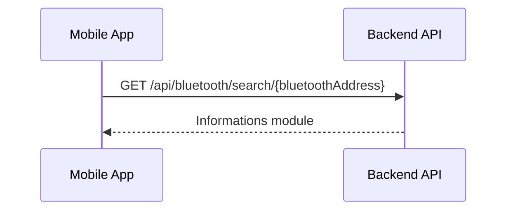
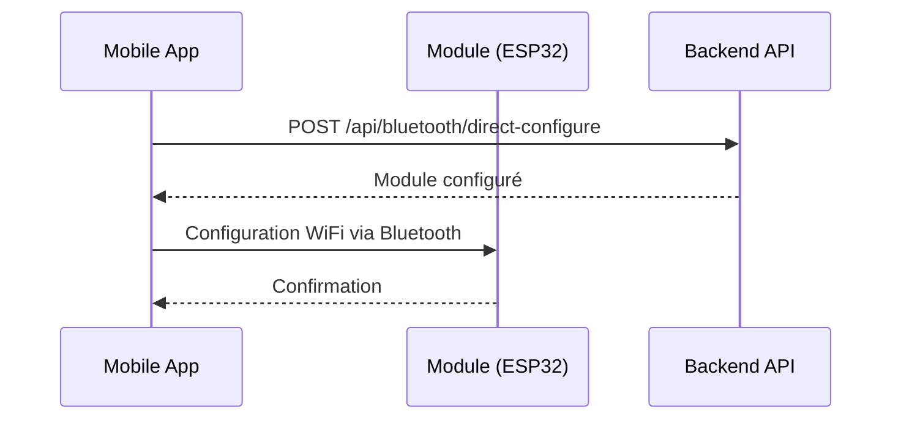
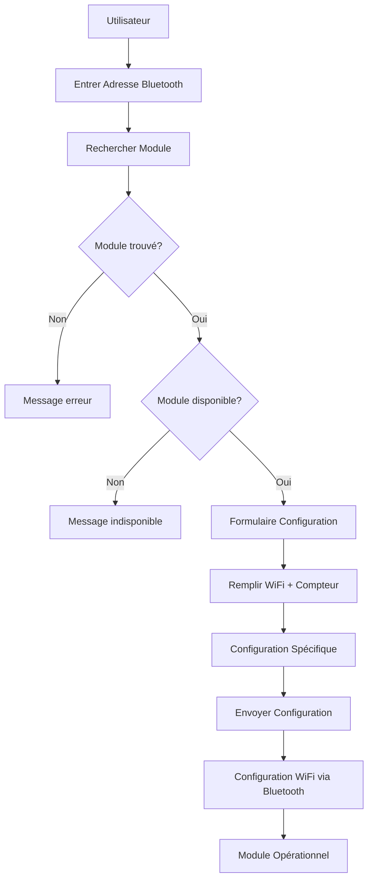

# 📱 **FLUX DE CONFIGURATION DIRECTE BLUETOOTH**

## 🎯 **Configuration sans Scan Bluetooth**

Quand l'utilisateur ne scanne pas les modules, il peut configurer directement un module en entrant son adresse Bluetooth manuellement.

---

## 🔄 **Workflow de Configuration Directe**

### **Étape 1: Recherche du Module**


**API Endpoint**: `GET /api/bluetooth/search/{bluetoothAddress}`

**Response JSON**:
```json
{
  "success": true,
  "data": {
    "bluetoothAddress": "AA:BB:CC:DD:EE:FF",
    "exists": true,
    "belongsToUser": false,
    "canConfigure": false,
    "statusMessage": "Module déjà associé à un autre utilisateur"
  }
}
```

**Scénarios possibles**:
- **Module non trouvé** : `exists: false`
- **Module déjà configuré** : `configured: true`
- **Module d'un autre utilisateur** : `belongsToUser: false`
- **Module disponible** : `canConfigure: true`

---

### **Étape 2: Configuration Directe**


**API Endpoint**: `POST /api/bluetooth/direct-configure`

**Request JSON - ESP32-CAM**:
```json
{
  "bluetoothAddress": "AA:BB:CC:DD:EE:FF",
  "typeModule": "ESP32_CAM",
  "moduleName": "ESP32-CAM-001",
  "firmwareVersion": "1.0.0",
  "userId": 1,
  "serialNumber": "ESP32-2024-001",
  "localisation": "Salon",
  "wifiSsid": "HomeWiFi",
  "wifiPassword": "password123",
  "compteurId": 1,
  "captureInterval": 3600,
  "resolutionCamera": "2MP",
  "flashActive": true,
  "qualiteImage": 80,
  "angleCapture": 90
}
```

**Request JSON - ESP32-PZEM004T**:
```json
{
  "bluetoothAddress": "AA:BB:CC:DD:EE:FF",
  "typeModule": "ESP32_PZEM004T",
  "moduleName": "ESP32-PZEM-001",
  "firmwareVersion": "2.1.0",
  "userId": 1,
  "serialNumber": "ESP32-2024-002",
  "localisation": "Cuisine",
  "wifiSsid": "HomeWiFi",
  "wifiPassword": "password123",
  "compteurId": 2,
  "captureInterval": 1800,
  "seuilAlerte": 0.15,
  "facteurCorrection": 1.05,
  "modeCalibrage": "MANUAL",
  "tensionMax": 500.0,
  "courantMax": 100.0,
  "puissanceMax": 22000.0
}
```

**Response JSON**:
```json
{
  "success": true,
  "data": {
    "deviceCode": "550e8400-e29b-41d4-a716-446655440000",
    "bluetoothAddress": "AA:BB:CC:DD:EE:FF",
    "typeModule": "ESP32_CAM",
    "statut": "EN_CONFIGURATION",
    "configured": false,
    "compteurId": 1,
    "compteurReference": "COMP-001",
    "captureInterval": 3600,
    "modeLectureAssocie": "ESP32_CAM",
    "resolutionCamera": "2MP",
    "flashActive": true,
    "qualiteImage": 80
  },
  "message": "Module configuré avec succès"
}
```

---

## 📱 **Interface Mobile - Écran de Configuration Directe**

### **Écran 1: Recherche Module**
```dart
class ModuleSearchScreen extends StatefulWidget {
  @override
  _ModuleSearchScreenState createState() => _ModuleSearchScreenState();
}

class _ModuleSearchScreenState extends State<ModuleSearchScreen> {
  final _formKey = GlobalKey<FormState>();
  final _bluetoothController = TextEditingController();
  bool isSearching = false;
  ModuleSearchResponse? searchResult;

  Future<void> searchModule() async {
    if (!_formKey.currentState!.validate()) return;
    
    setState(() => isSearching = true);
    
    try {
      final response = await http.get(
        Uri.parse('$baseUrl/api/bluetooth/search/${_bluetoothController.text}'),
        headers: {'Authorization': 'Bearer $token'},
      );
      
      if (response.statusCode == 200) {
        final data = jsonDecode(response.body)['data'];
        setState(() {
          searchResult = ModuleSearchResponse.fromJson(data);
          isSearching = false;
        });
      }
    } catch (e) {
      setState(() => isSearching = false);
      ScaffoldMessenger.of(context).showSnackBar(
        SnackBar(content: Text('Erreur lors de la recherche: $e')),
      );
    }
  }

  @override
  Widget build(BuildContext context) {
    return Scaffold(
      appBar: AppBar(title: Text('Rechercher Module')),
      body: Padding(
        padding: EdgeInsets.all(16.0),
        child: Form(
          key: _formKey,
          child: Column(
            children: [
              TextFormField(
                controller: _bluetoothController,
                decoration: InputDecoration(
                  labelText: 'Adresse Bluetooth',
                  hintText: 'AA:BB:CC:DD:EE:FF',
                  prefixIcon: Icon(Icons.bluetooth),
                ),
                validator: (value) {
                  if (value == null || value.isEmpty) {
                    return 'L\'adresse Bluetooth est obligatoire';
                  }
                  if (!RegExp(r'^([0-9A-Fa-f]{2}[:-]){5}([0-9A-Fa-f]{2})$').hasMatch(value)) {
                    return 'Format d\'adresse Bluetooth invalide';
                  }
                  return null;
                },
              ),
              SizedBox(height: 16),
              ElevatedButton(
                onPressed: isSearching ? null : searchModule,
                child: isSearching 
                    ? CircularProgressIndicator(color: Colors.white)
                    : Text('Rechercher'),
              ),
              if (searchResult != null) ...[
                SizedBox(height: 20),
                _buildSearchResult(),
              ],
            ],
          ),
        ),
      ),
    );
  }

  Widget _buildSearchResult() {
    return Card(
      child: Padding(
        padding: EdgeInsets.all(16.0),
        child: Column(
          crossAxisAlignment: CrossAxisAlignment.start,
          children: [
            Row(
              children: [
                Icon(
                  searchResult!.exists ? Icons.check_circle : Icons.error,
                  color: searchResult!.exists ? Colors.green : Colors.red,
                ),
                SizedBox(width: 8),
                Text(
                  searchResult!.statusMessage,
                  style: TextStyle(
                    fontWeight: FontWeight.bold,
                    color: searchResult!.canConfigure ? Colors.green : Colors.red,
                  ),
                ),
              ],
            ),
            if (searchResult!.exists) ...[
              SizedBox(height: 8),
              Text('Type: ${searchResult!.typeModule}'),
              Text('Nom: ${searchResult!.moduleName}'),
              if (searchResult!.firmwareVersion != null)
                Text('Firmware: ${searchResult!.firmwareVersion}'),
            ],
            if (searchResult!.canConfigure) ...[
              SizedBox(height: 16),
              ElevatedButton(
                onPressed: () {
                  Navigator.push(
                    context,
                    MaterialPageRoute(
                      builder: (context) => ModuleDirectConfigScreen(
                        bluetoothAddress: searchResult!.bluetoothAddress,
                        moduleType: searchResult!.typeModule!,
                      ),
                    ),
                  );
                },
                child: Text('Configurer ce module'),
                style: ElevatedButton.styleFrom(
                  backgroundColor: Colors.green,
                  foregroundColor: Colors.white,
                ),
              ),
            ],
          ],
        ),
      ),
    );
  }
}
```

### **Écran 2: Configuration Directe**
```dart
class ModuleDirectConfigScreen extends StatefulWidget {
  final String bluetoothAddress;
  final TypeModuleDevice moduleType;
  
  ModuleDirectConfigScreen({
    required this.bluetoothAddress,
    required this.moduleType,
  });
  
  @override
  _ModuleDirectConfigScreenState createState() => _ModuleDirectConfigScreenState();
}

class _ModuleDirectConfigScreenState extends State<ModuleDirectConfigScreen> {
  final _formKey = GlobalKey<FormState>();
  final _wifiSsidController = TextEditingController();
  final _wifiPasswordController = TextEditingController();
  final _compteurController = TextEditingController();
  final _captureIntervalController = TextEditingController(text: '3600');
  final _localisationController = TextEditingController();
  
  bool isConfiguring = false;
  List<Compteur> compteurs = [];
  Compteur? selectedCompteur;
  
  // Champs spécifiques ESP32-CAM
  final _resolutionController = TextEditingController(text: '2MP');
  bool _flashActive = true;
  final _qualiteController = TextEditingController(text: '80');
  final _angleController = TextEditingController(text: '90');
  
  // Champs spécifiques ESP32-PZEM004T
  final _seuilAlerteController = TextEditingController(text: '0.15');
  final _facteurCorrectionController = TextEditingController(text: '1.05');
  final _modeCalibrageController = TextEditingController(text: 'MANUAL');

  @override
  void initState() {
    super.initState();
    loadCompteurs();
  }

  Future<void> loadCompteurs() async {
    final response = await http.get(
      Uri.parse('$baseUrl/api/compteurs'),
      headers: {'Authorization': 'Bearer $token'},
    );
    
    if (response.statusCode == 200) {
      final data = jsonDecode(response.body)['data'];
      setState(() {
        compteurs = (data as List).map((e) => Compteur.fromJson(e)).toList();
      });
    }
  }

  Future<void> configureModule() async {
    if (!_formKey.currentState!.validate() || selectedCompteur == null) return;
    
    setState(() => isConfiguring = true);
    
    try {
      final request = {
        'bluetoothAddress': widget.bluetoothAddress,
        'typeModule': widget.moduleType.name,
        'moduleName': 'Module-${widget.moduleType.name}',
        'firmwareVersion': '1.0.0',
        'userId': userId,
        'wifiSsid': _wifiSsidController.text,
        'wifiPassword': _wifiPasswordController.text,
        'compteurId': selectedCompteur!.id,
        'captureInterval': int.parse(_captureIntervalController.text),
        'localisation': _localisationController.text,
      };
      
      // Ajouter les champs spécifiques selon le type
      if (widget.moduleType == TypeModuleDevice.ESP32_CAM) {
        request.addAll({
          'resolutionCamera': _resolutionController.text,
          'flashActive': _flashActive,
          'qualiteImage': int.parse(_qualiteController.text),
          'angleCapture': int.parse(_angleController.text),
        });
      } else if (widget.moduleType == TypeModuleDevice.ESP32_PZEM004T) {
        request.addAll({
          'seuilAlerte': double.parse(_seuilAlerteController.text),
          'facteurCorrection': double.parse(_facteurCorrectionController.text),
          'modeCalibrage': _modeCalibrageController.text,
        });
      }
      
      final response = await http.post(
        Uri.parse('$baseUrl/api/bluetooth/direct-configure'),
        headers: {
          'Authorization': 'Bearer $token',
          'Content-Type': 'application/json',
        },
        body: jsonEncode(request),
      );
      
      if (response.statusCode == 200) {
        // Configurer WiFi via Bluetooth
        await configureWiFiViaBluetooth();
        
        // Naviguer vers écran de succès
        Navigator.pushReplacement(
          context,
          MaterialPageRoute(builder: (context) => ModuleConfiguredScreen()),
        );
      }
    } catch (e) {
      ScaffoldMessenger.of(context).showSnackBar(
        SnackBar(content: Text('Erreur de configuration: $e')),
      );
    } finally {
      setState(() => isConfiguring = false);
    }
  }

  Future<void> configureWiFiViaBluetooth() async {
    // Se connecter au device Bluetooth
    // Envoyer configuration WiFi
    // Attendre confirmation
    // Déconnexion
  }

  @override
  Widget build(BuildContext context) {
    return Scaffold(
      appBar: AppBar(title: Text('Configuration Module')),
      body: SingleChildScrollView(
        padding: EdgeInsets.all(16.0),
        child: Form(
          key: _formKey,
          child: Column(
            crossAxisAlignment: CrossAxisAlignment.start,
            children: [
              // Informations de base
              Card(
                child: Padding(
                  padding: EdgeInsets.all(16.0),
                  child: Column(
                    crossAxisAlignment: CrossAxisAlignment.start,
                    children: [
                      Text('Informations Module', style: TextStyle(fontSize: 18, fontWeight: FontWeight.bold)),
                      SizedBox(height: 8),
                      Text('Adresse: ${widget.bluetoothAddress}'),
                      Text('Type: ${widget.moduleType.name}'),
                    ],
                  ),
                ),
              ),
              
              // Configuration WiFi
              Card(
                child: Padding(
                  padding: EdgeInsets.all(16.0),
                  child: Column(
                    crossAxisAlignment: CrossAxisAlignment.start,
                    children: [
                      Text('Configuration WiFi', style: TextStyle(fontSize: 18, fontWeight: FontWeight.bold)),
                      SizedBox(height: 8),
                      TextFormField(
                        controller: _wifiSsidController,
                        decoration: InputDecoration(labelText: 'SSID WiFi'),
                        validator: (value) => value?.isEmpty ?? true ? 'SSID obligatoire' : null,
                      ),
                      TextFormField(
                        controller: _wifiPasswordController,
                        decoration: InputDecoration(labelText: 'Mot de passe WiFi'),
                        obscureText: true,
                        validator: (value) => value?.isEmpty ?? true ? 'Mot de passe obligatoire' : null,
                      ),
                    ],
                  ),
                ),
              ),
              
              // Configuration compteur
              Card(
                child: Padding(
                  padding: EdgeInsets.all(16.0),
                  child: Column(
                    crossAxisAlignment: CrossAxisAlignment.start,
                    children: [
                      Text('Association Compteur', style: TextStyle(fontSize: 18, fontWeight: FontWeight.bold)),
                      SizedBox(height: 8),
                      DropdownButtonFormField<Compteur>(
                        value: selectedCompteur,
                        decoration: InputDecoration(labelText: 'Compteur'),
                        items: compteurs.map((compteur) {
                          return DropdownMenuItem(
                            value: compteur,
                            child: Text('${compteur.reference} - ${compteur.adresse}'),
                          );
                        }).toList(),
                        onChanged: (value) => setState(() => selectedCompteur = value),
                        validator: (value) => value == null ? 'Compteur obligatoire' : null,
                      ),
                      TextFormField(
                        controller: _captureIntervalController,
                        decoration: InputDecoration(labelText: 'Intervalle de capture (secondes)'),
                        keyboardType: TextInputType.number,
                        validator: (value) {
                          if (value?.isEmpty ?? true) return 'Intervalle obligatoire';
                          if (int.tryParse(value!) == null) return 'Nombre invalide';
                          return null;
                        },
                      ),
                      TextFormField(
                        controller: _localisationController,
                        decoration: InputDecoration(labelText: 'Localisation'),
                      ),
                    ],
                  ),
                ),
              ),
              
              // Configuration spécifique selon type
              if (widget.moduleType == TypeModuleDevice.ESP32_CAM) _buildESP32CamConfig(),
              if (widget.moduleType == TypeModuleDevice.ESP32_PZEM004T) _buildESP32PzemConfig(),
              
              SizedBox(height: 20),
              ElevatedButton(
                onPressed: isConfiguring ? null : configureModule,
                child: isConfiguring 
                    ? CircularProgressIndicator(color: Colors.white)
                    : Text('Configurer Module'),
                style: ElevatedButton.styleFrom(
                  minimumSize: Size(double.infinity, 50),
                ),
              ),
            ],
          ),
        ),
      ),
    );
  }

  Widget _buildESP32CamConfig() {
    return Card(
      child: Padding(
        padding: EdgeInsets.all(16.0),
        child: Column(
          crossAxisAlignment: CrossAxisAlignment.start,
          children: [
            Text('Configuration ESP32-CAM', style: TextStyle(fontSize: 18, fontWeight: FontWeight.bold)),
            SizedBox(height: 8),
            TextFormField(
              controller: _resolutionController,
              decoration: InputDecoration(labelText: 'Résolution caméra'),
            ),
            SwitchListTile(
              title: Text('Flash actif'),
              value: _flashActive,
              onChanged: (value) => setState(() => _flashActive = value),
            ),
            TextFormField(
              controller: _qualiteController,
              decoration: InputDecoration(labelText: 'Qualité image (%)'),
              keyboardType: TextInputType.number,
            ),
            TextFormField(
              controller: _angleController,
              decoration: InputDecoration(labelText: 'Angle de capture (°)'),
              keyboardType: TextInputType.number,
            ),
          ],
        ),
      ),
    );
  }

  Widget _buildESP32PzemConfig() {
    return Card(
      child: Padding(
        padding: EdgeInsets.all(16.0),
        child: Column(
          crossAxisAlignment: CrossAxisAlignment.start,
          children: [
            Text('Configuration ESP32-PZEM004T', style: TextStyle(fontSize: 18, fontWeight: FontWeight.bold)),
            SizedBox(height: 8),
            TextFormField(
              controller: _seuilAlerteController,
              decoration: InputDecoration(labelText: 'Seuil d\'alerte'),
              keyboardType: TextInputType.number,
            ),
            TextFormField(
              controller: _facteurCorrectionController,
              decoration: InputDecoration(labelText: 'Facteur de correction'),
              keyboardType: TextInputType.number,
            ),
            TextFormField(
              controller: _modeCalibrageController,
              decoration: InputDecoration(labelText: 'Mode de calibrage'),
            ),
          ],
        ),
      ),
    );
  }
}
```

---

## 🎯 **Avantages de la Configuration Directe**

### **Flexibilité**
- ✅ **Pas de scan requis** : Configuration par adresse directe
- ✅ **Compatible avec tous les modules** : ESP32-CAM et ESP32-PZEM004T
- ✅ **Validation immédiate** : Vérification avant configuration

### **Sécurité**
- ✅ **Contrôle d'accès** : Vérification propriétaire
- ✅ **Validation compatibilité** : Module-compteur
- ✅ **Configuration sécurisée** : WiFi via Bluetooth

### **Expérience Utilisateur**
- ✅ **Simple** : Saisie manuelle de l'adresse
- ✅ **Rapide** : Pas d'attente de scan
- ✅ **Fiable** : Configuration directe sans aléas

---

## 🔄 **Workflow Complet**



**Ce workflow permet une configuration complète sans nécessiter de scan Bluetooth, offrant une alternative simple et directe pour les utilisateurs.** 🚀
