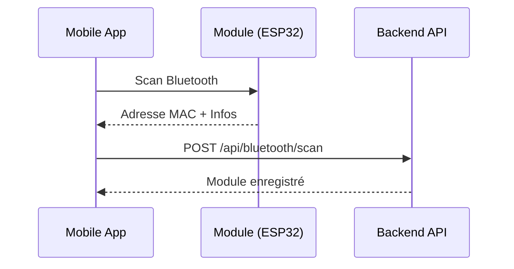
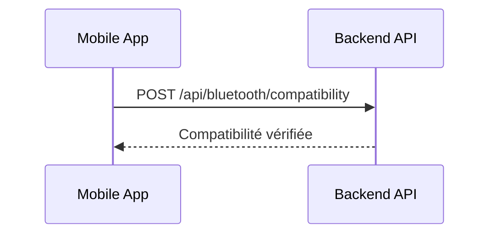
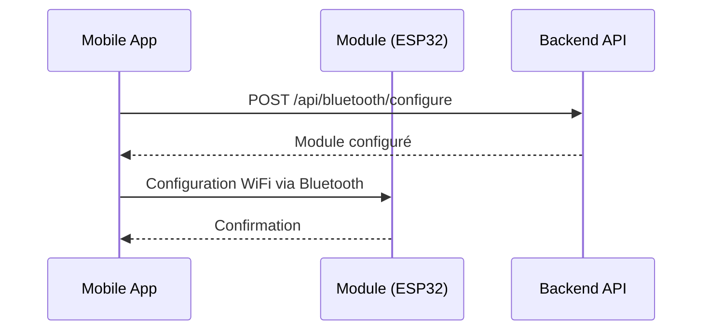
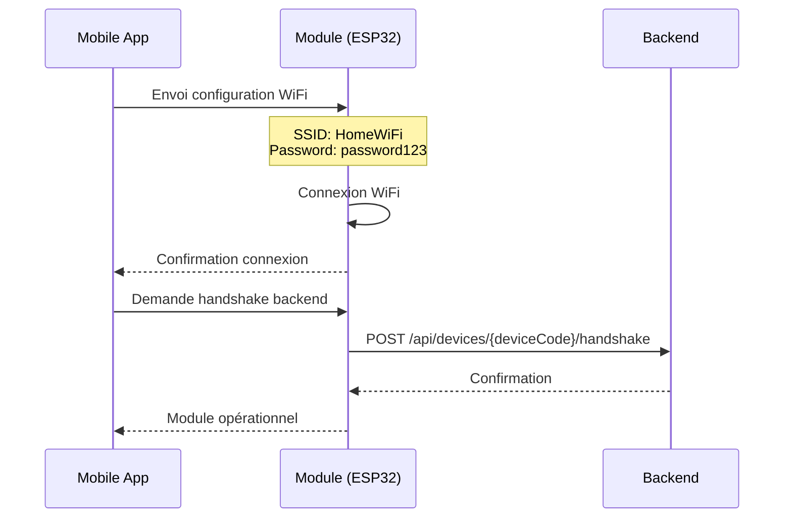
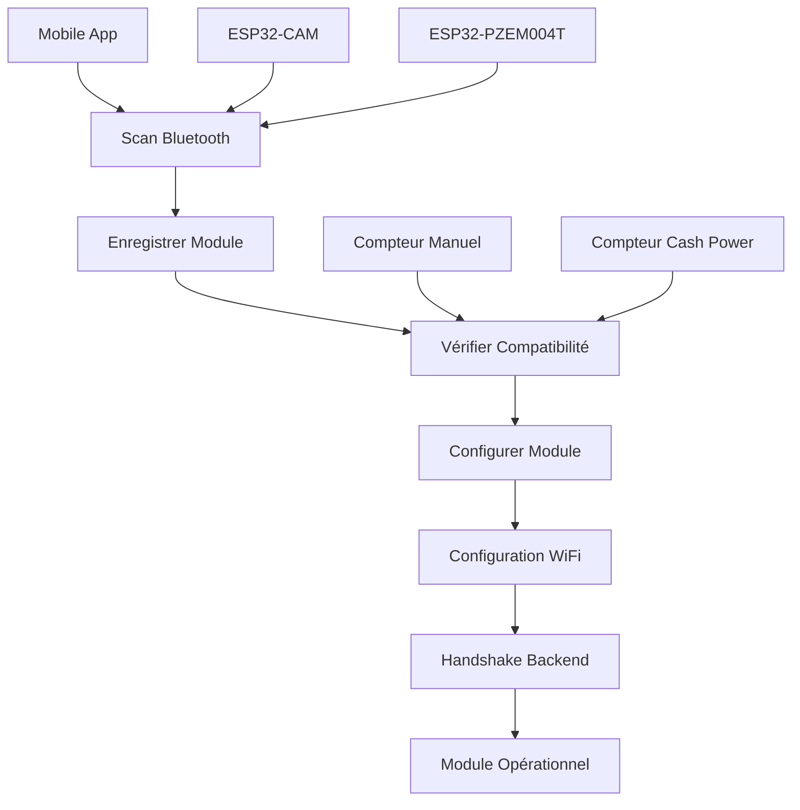

# 📱 **FLUX D'ONBOARDING MOBILE VIA BLUETOOTH**

## 🔄 **Workflow Complet pour Configuration Mobile**

### **Étape 1: Scan Bluetooth**


**API Endpoint**: `POST /api/bluetooth/scan`

**Request JSON**:
```json
{
  "bluetoothAddress": "AA:BB:CC:DD:EE:FF",
  "typeModule": "ESP32_CAM",
  "moduleName": "ESP32-CAM-001",
  "firmwareVersion": "1.0.0",
  "userId": 1,
  "serialNumber": "ESP32-2024-001",
  "signalStrength": -65,
  "manufacturerData": "4D455445525945"
}
```

**Response JSON**:
```json
{
  "success": true,
  "data": {
    "deviceCode": "550e8400-e29b-41d4-a716-446655440000",
    "bluetoothAddress": "AA:BB:CC:DD:EE:FF",
    "typeModule": "ESP32_CAM",
    "statut": "NON_CONFIGURE",
    "configured": false,
    "firmwareVersion": "1.0.0",
    "proprietaireId": 1,
    "modeLectureAssocie": "ESP32_CAM"
  },
  "message": "Module scanné avec succès"
}
```

---

### **Étape 2: Vérification Compatibilité**


**API Endpoint**: `POST /api/bluetooth/compatibility`

**Request JSON**:
```json
{
  "bluetoothAddress": "AA:BB:CC:DD:EE:FF",
  "compteurId": 1
}
```

**Response JSON**:
```json
{
  "success": true,
  "data": {
    "bluetoothAddress": "AA:BB:CC:DD:EE:FF",
    "compteurId": 1,
    "compatible": true,
    "message": "Module compatible avec le compteur"
  }
}
```

---

### **Étape 3: Configuration et Association**


**API Endpoint**: `POST /api/bluetooth/configure`

**Request JSON - ESP32-CAM**:
```json
{
  "bluetoothAddress": "AA:BB:CC:DD:EE:FF",
  "compteurId": 1,
  "captureInterval": 3600,
  "wifiSsid": "HomeWiFi",
  "wifiPassword": "password123",
  "nomModule": "ESP32-CAM-Salon",
  "localisation": "Salon",
  "resolutionCamera": "2MP",
  "flashActive": true,
  "qualiteImage": 80,
  "angleCapture": 90
}
```

**Request JSON - ESP32-PZEM004T**:
```json
{
  "bluetoothAddress": "AA:BB:CC:DD:EE:FF",
  "compteurId": 2,
  "captureInterval": 1800,
  "wifiSsid": "HomeWiFi",
  "wifiPassword": "password123",
  "nomModule": "ESP32-PZEM-Cuisine",
  "localisation": "Cuisine",
  "seuilAlerte": 0.15,
  "facteurCorrection": 1.05,
  "modeCalibrage": "MANUAL",
  "tensionMax": 500.0,
  "courantMax": 100.0,
  "puissanceMax": 22000.0
}
```

**Response JSON**:
```json
{
  "success": true,
  "data": {
    "deviceCode": "550e8400-e29b-41d4-a716-446655440000",
    "bluetoothAddress": "AA:BB:CC:DD:EE:FF",
    "typeModule": "ESP32_CAM",
    "statut": "EN_CONFIGURATION",
    "configured": false,
    "compteurId": 1,
    "compteurReference": "COMP-001",
    "captureInterval": 3600,
    "modeLectureAssocie": "ESP32_CAM",
    "resolutionCamera": "2MP",
    "flashActive": true,
    "qualiteImage": 80
  },
  "message": "Module configuré avec succès"
}
```

---

### **Étape 4: Configuration WiFi via Bluetooth**


**Commandes Bluetooth pour ESP32**:
```json
{
  "command": "CONFIGURE_WIFI",
  "ssid": "HomeWiFi",
  "password": "password123",
  "deviceCode": "550e8400-e29b-41d4-a716-446655440000"
}
```

---

### **Étape 5: Handshake Final**
**API Endpoint**: `POST /api/devices/{deviceCode}/handshake`

**Request JSON**:
```json
{
  "firmwareVersion": "1.0.0",
  "ipAddress": "192.168.1.100",
  "wifiSsid": "HomeWiFi"
}
```

**Response JSON**:
```json
{
  "success": true,
  "data": {
    "deviceCode": "550e8400-e29b-41d4-a716-446655440000",
    "typeModule": "ESP32_CAM",
    "statut": "ACTIF",
    "configured": true,
    "lastSeenAt": "2026-04-13T10:30:00Z",
    "ipAddress": "192.168.1.100",
    "wifiSsid": "HomeWiFi"
  },
  "message": "Handshake réussi"
}
```

---

## 📋 **Endpoints Bluetooth Complémentaires**

### **Lister Modules Disponibles**
```http
GET /api/bluetooth/available
Authorization: Bearer {token}

Response:
{
  "success": true,
  "data": [
    {
      "deviceCode": "550e8400-e29b-41d4-a716-446655440000",
      "bluetoothAddress": "AA:BB:CC:DD:EE:FF",
      "typeModule": "ESP32_CAM",
      "statut": "NON_CONFIGURE",
      "configured": false,
      "firmwareVersion": "1.0.0"
    }
  ]
}
```

### **Informations Module**
```http
GET /api/bluetooth/{bluetoothAddress}
Authorization: Bearer {token}

Response:
{
  "success": true,
  "data": {
    "deviceCode": "550e8400-e29b-41d4-a716-446655440000",
    "bluetoothAddress": "AA:BB:CC:DD:EE:FF",
    "typeModule": "ESP32_CAM",
    "statut": "ACTIF",
    "configured": true,
    "compteurId": 1,
    "compteurReference": "COMP-001"
  }
}
```

### **Supprimer Module Non Configuré**
```http
DELETE /api/bluetooth/{bluetoothAddress}
Authorization: Bearer {token}

Response:
{
  "success": true,
  "message": "Module supprimé avec succès"
}
```

---

## 🔄 **Logique Firmware ESP32**

### **Mode Bluetooth Setup**
```cpp
// ESP32 Bluetooth Setup Mode
class BluetoothSetup {
private:
    String deviceCode;
    String bluetoothAddress;
    bool configured = false;
    
public:
    void startBluetoothMode() {
        // Démarrer BLE advertising
        BLEDevice::init("MeterEye-" + deviceCode.substring(0, 8));
        BLEAdvertising *pAdvertising = BLEDevice::getAdvertising();
        
        // Caractéristiques pour configuration
        BLEService *pService = pServer->createService(BLE_UUID);
        pCharacteristic = pService->createCharacteristic(
            CONFIG_UUID,
            BLECharacteristic::PROPERTY_READ | BLECharacteristic::PROPERTY_WRITE
        );
        
        pAdvertising->start();
    }
    
    void handleWiFiConfig(String ssid, String password) {
        // Sauvegarder configuration WiFi
        preferences.putString("wifi_ssid", ssid);
        preferences.putString("wifi_password", password);
        
        // Tenter connexion WiFi
        WiFi.begin(ssid.c_str(), password.c_str());
        
        // Si succès, faire handshake backend
        if (WiFi.status() == WL_CONNECTED) {
            performHandshake();
        }
    }
    
    void performHandshake() {
        HTTPClient http;
        http.begin("http://localhost:8080/api/devices/" + deviceCode + "/handshake");
        
        String payload = "{";
        payload += "\"firmwareVersion\":\"" + FIRMWARE_VERSION + "\",";
        payload += "\"ipAddress\":\"" + WiFi.localIP().toString() + "\",";
        payload += "\"wifiSsid\":\"" + preferences.getString("wifi_ssid") + "\"";
        payload += "}";
        
        int httpResponseCode = http.POST(payload);
        
        if (httpResponseCode == 200) {
            configured = true;
            stopBluetoothMode();
            startNormalMode();
        }
    }
};
```

---

## 📱 **Interface Mobile - Écrans Clés**

### **Écran 1: Scan Bluetooth**
```dart
class BluetoothScanScreen extends StatefulWidget {
  @override
  _BluetoothScanScreenState createState() => _BluetoothScanScreenState();
}

class _BluetoothScanScreenState extends State<BluetoothScanScreen> {
  List<BluetoothDevice> discoveredDevices = [];
  bool isScanning = false;

  Future<void> startScan() async {
    setState(() => isScanning = true);
    
    // Scan Bluetooth
    List<BluetoothDevice> devices = await FlutterBlue.startScan(timeout: Duration(seconds: 10));
    
    // Filtrer devices MeterEye
    List<BluetoothDevice> meterEyeDevices = devices.where((device) => 
        device.name.startsWith('MeterEye')).toList();
    
    // Enregistrer chaque device
    for (BluetoothDevice device in meterEyeDevices) {
      await registerDevice(device);
    }
    
    setState(() {
      discoveredDevices = meterEyeDevices;
      isScanning = false;
    });
  }

  Future<void> registerDevice(BluetoothDevice device) async {
    final response = await http.post(
      Uri.parse('$baseUrl/api/bluetooth/scan'),
      headers: {'Authorization': 'Bearer $token', 'Content-Type': 'application/json'},
      body: jsonEncode({
        'bluetoothAddress': device.id,
        'typeModule': device.name.contains('CAM') ? 'ESP32_CAM' : 'ESP32_PZEM004T',
        'moduleName': device.name,
        'firmwareVersion': '1.0.0',
        'userId': userId,
        'signalStrength': device.rssi,
      }),
    );
    
    if (response.statusCode == 201) {
      // Device registered successfully
    }
  }
}
```

### **Écran 2: Configuration Module**
```dart
class ModuleConfigurationScreen extends StatefulWidget {
  final BluetoothDevice device;
  final Compteur compteur;
  
  ModuleConfigurationScreen({required this.device, required this.compteur});
  
  @override
  _ModuleConfigurationScreenState createState() => _ModuleConfigurationScreenState();
}

class _ModuleConfigurationScreenState extends State<ModuleConfigurationScreen> {
  final _formKey = GlobalKey<FormState>();
  String wifiSSID = '';
  String wifiPassword = '';
  int captureInterval = 3600;
  
  Future<void> configureModule() async {
    if (!_formKey.currentState!.validate()) return;
    
    final response = await http.post(
      Uri.parse('$baseUrl/api/bluetooth/configure'),
      headers: {'Authorization': 'Bearer $token', 'Content-Type': 'application/json'},
      body: jsonEncode({
        'bluetoothAddress': widget.device.id,
        'compteurId': widget.compteur.id,
        'captureInterval': captureInterval,
        'wifiSsid': wifiSSID,
        'wifiPassword': wifiPassword,
        'nomModule': widget.device.name,
        'localisation': 'Default',
      }),
    );
    
    if (response.statusCode == 200) {
      // Configurer WiFi via Bluetooth
      await configureWiFiViaBluetooth();
      
      // Naviguer vers écran de confirmation
      Navigator.pushReplacement(
        context,
        MaterialPageRoute(builder: (context) => ModuleConfiguredScreen()),
      );
    }
  }
  
  Future<void> configureWiFiViaBluetooth() async {
    // Se connecter au device Bluetooth
    await device.connect();
    
    // Envoyer configuration WiFi
    await device.write({
      'command': 'CONFIGURE_WIFI',
      'ssid': wifiSSID,
      'password': wifiPassword,
      'deviceCode': deviceCode,
    });
    
    // Attendre confirmation
    await Future.delayed(Duration(seconds: 5));
    
    // Déconnexion
    await device.disconnect();
  }
}
```

---

## 🎯 **Avantages du Flux Bluetooth**

### **Simplicité**
- ✅ **Pas de QR code** : Scan direct via Bluetooth
- ✅ **Configuration mobile** : Tout depuis l'app mobile
- ✅ **Validation immédiate** : Compatibilité vérifiée en temps réel

### **Sécurité**
- ✅ **Appairage sécurisé** : Bluetooth sécurisé
- ✅ **Authentification** : Token JWT requis
- ✅ **Validation utilisateur** : Modules liés au propriétaire

### **Expérience Utilisateur**
- ✅ **Fluide** : Workflow en 3 étapes simples
- ✅ **Guidé** : Interface mobile intuitive
- ✅ **Instantané** : Configuration immédiate

---

## 🔄 **Workflow Final Complet**



**Ce flux remplace complètement la logique QR code par une configuration directe via Bluetooth, offrant une expérience utilisateur plus simple et plus moderne.** 🚀
